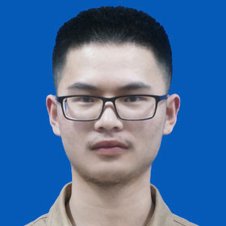

## Zeyu Ma

I am a fourth-year PhD candidate in the Vision & Learning Lab at Princeton University, supervised by Prof. Jia Deng. I received my B.Eng. in Electronic Engineering from Tsinghua University in 2020. My current research focuses on multi-view 3D reconstruction and procedural data generation for 3D vision tasks.

[Email](mailto:zeyum@princeton.edu)  /  [GitHub](https://github.com/mazeyu)

## Research
[Infinigen: Infinite Photorealistic Worlds using Procedural Generation](https://arxiv.org/pdf/2306.09310.pdf) \
Alexander Raistrick*, Lahav Lipson*, **Zeyu Ma** *  (*equal contribution, alphabetical order), Lingjie Mei, Mingzhe Wang, Yiming Zuo, Karhan Kayan, Hongyu Wen, Beining Han, Yihan Wang, Alejandro Newell, Hei Law, Ankit Goyal, Kaiyu Yang, Jia Deng \
Computer Vision and Pattern Recognition Conference (CVPR), 2023

[Multiview Stereo with Cascaded Epipolar RAFT](https://arxiv.org/pdf/2205.04502.pdf) \
**Zeyu Ma**, Zachary Teed, Jia Deng  \
European Conference on Computer Vision (ECCV), 2022

[Supervoxel convolution for online 3d semantic segmentation](https://dl.acm.org/doi/abs/10.1145/3453485) \
Shi-Sheng Huang, **Ze-Yu Ma**, Tai-Jiang Mu, Hongbo Fu, Shi-Min Hu \
ACM Transactions on Graphics (TOG), 2021

[3D Spatial Coverage Measurement of Aerial Images](https://link.springer.com/chapter/10.1007/978-3-030-37731-1_30) \
Abdullah Alfarrarjeh, **Zeyu Ma**, Seon Ho Kim, Cyrus Shahabi \
International Conference on Multimedia Modeling (MMM), 2020

[A Web-based Visualization Tool for 3D Spatial Coverage Measurement of Aerial Images](https://link.springer.com/chapter/10.1007/978-3-030-37734-2_59) \
Abdullah Alfarrarjeh, **Zeyu Ma**, Seon Ho Kim, Yeonsoo Park, Cyrus Shahabi  \
International Conference on Multimedia Modeling (MMM), 2020 (Demo paper)

[LiDAR-Monocular Visual Odometry using Point and Line Features](https://ieeexplore.ieee.org/abstract/document/9196613) \
Shi-Sheng Huang, **Ze-Yu Ma**, Tai-Jiang Mu, Hongbo Fu, Shi-Min Hu \
International Conference on Robotics and Automation (ICRA), 2020
